## Operations

### Register Account

1).  Enter the signup page <https://rsp.simlessly.com/signup> of Simlessly RSP Platform, fill in the information required to register an account.

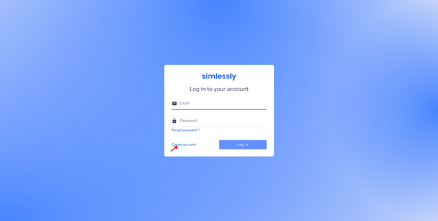

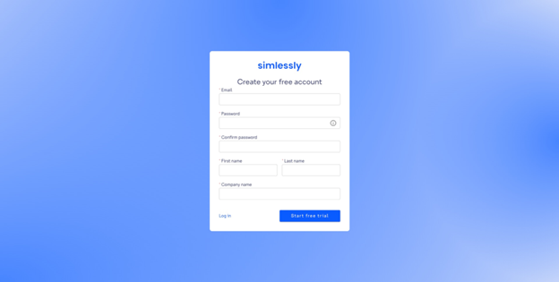

2). Click the activation button in the registration instruction 
Email sent to your Email box to activate your account. 

### Log in to Platform
After activation, log in to the Simlessly RSP Platform <https://rsp.simlessly.com/login> with your username and password.

### Set up Profile Template Configuration

After log in, before importing Profiles, you need to configure the Profile template for defining the use of Profiles. The platform provides 4 types of Profile template – Regular, Conformance Test, Private LTE and Advanced, which are respectively used for importing general & Travel eSIM Profiles, importing Profiles for RF & Protocol Test, importing Profiles for CBRS & Lab Test and  importing Profiles for  registering IMS and Applet. The parameters of the templates vary among different subscription plan grades. 

1).  In the Simlessly RSP Platform web portal, enter the Configuration page. Two default templates are provided on the platform, you can click Add configuration to create new templates.

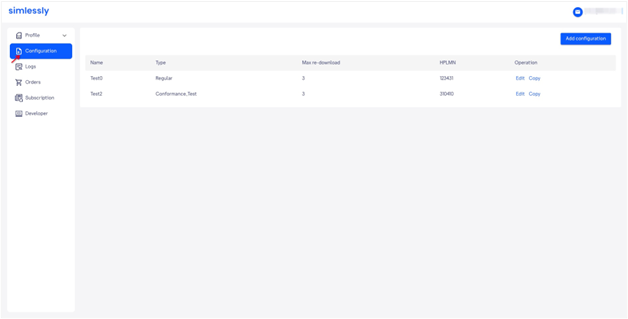

2).  Select configuration type.

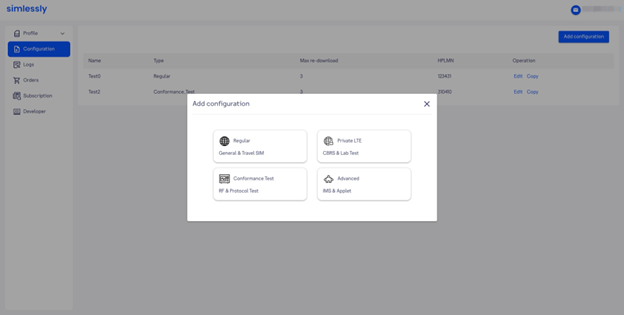

<table>
    <tr>
        <th>Type</th>
        <th>Description</th>
    </tr>
    <tr>
        <td>Regular</td>
        <td>Configure template for importing general & Travel eSIM Profiles</td>
    </tr>
    <tr>
        <td>Private LTE</td>
        <td>Configure template for importing Profiles for performing CBRS & Lab Test</td>
    </tr>
    <tr>
        <td>Conformance Test</td>
        <td>Configure template for importing Profiles for performing RF & Protocol Test</td>
    </tr>
    <tr>
        <td>Advanced</td>
        <td>Configure template for importing Profiles for registering IMS and Applet</td>
    </tr>
</table>

3).  Fill in the parameters required, wherein HPLMN and OPLMN are the most essential.

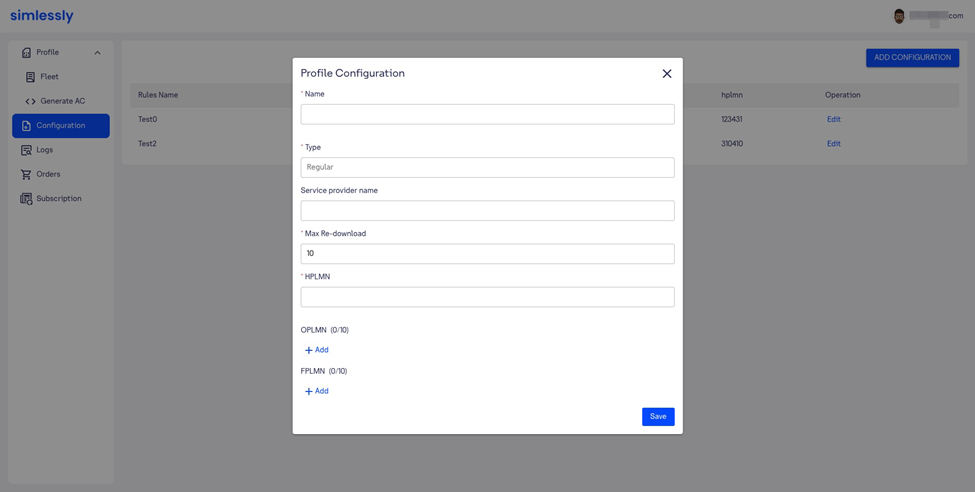

<table class="table table-bordered">
    <tr>
        <th>Parameter</th>
        <th>Description</th>
    </tr>
    <tr>
        <td>Name</td>
        <td>Configure the name of Profile template</td>
    </tr>
    <tr>
        <td>Type</td>
        <td>Show selected Profile template type</td>
    </tr>
    <tr>
        <td>Service provider name</td>
        <td>Enter Operator name, which will be displayed on the device.</td>
    </tr>
    <tr>
        <td>Max Re-download</td>
        <td>Configure number of maximum Profile downloads</td>
    </tr>
    <tr>
        <td>HPLMN</td>
        <td>Enter home PLMN</td>
    </tr>
    <tr>
        <td>OPLMN</td>
        <td>Enter optional PLMN</td>
    </tr>
    <tr>
        <td>FPLMN</td>
        <td>Enter forbidden PLMN</td>
    </tr>
</table>

3). Click Save.

Note:
- When you change the parameters of a Profile template, it will take effect for the next batch of Profiles. If you need to apply the configurations to existing Profiles, you need to delete the Profiles and re-import.
- The types of Profile template vary among different subscription plan grades (Basic/Pro/Premium).  The parameters of each template type are also different among the subscription plan grades. For the details, please contact the Simlessly RSP Platform operation team.

### Import Profile Data

1). Enter the Generate AC page (Profile -> Generate AC);

2). Download the Profile import template file and fill in the Profile data (you can also create an excel table (xls/xlsx) to prepare the Profile data, attention needs to be paid to the parameters required, shown in below table);

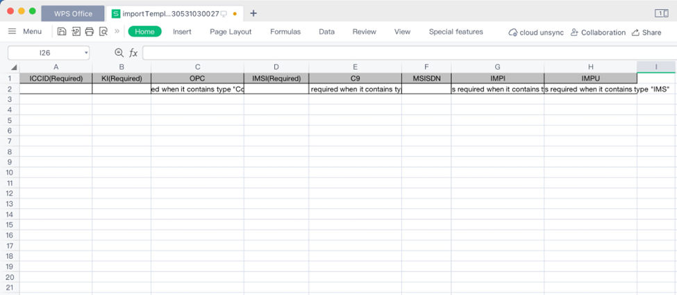

Parameter Description
<table>
    <tr>
        <th>ICCID</th>
        <th>KI</th>
        <th>OPC</th>
        <th>IMSI</th>
        <th>C9</th>
        <th>MSISDN</th>
        <th>IMPI</th>
        <th>IMPU</th>
    </tr>
    <tr>
        <td>Required</td>
        <td>Required</td>
        <td>Required for template type "Conformance_Test"</td>
        <td>Required</td>
        <td>Required for template type "Applet"</td>
        <td>Optional</td>
        <td>Required for template type "Advanced"</td>
        <td>Required for template type "Advanced"</td>
    </tr>
</table>

3). Select Profile template;

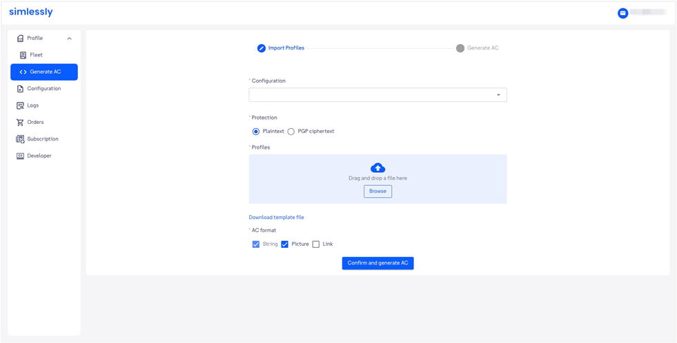

4). Select Profile data protection mode (Plaintext / PGP ciphertext). When you need to protect the  Profile data by PGP encryption, you need to download the PGP public key, encrypt the profile data  with the public key by an encryption tool, then upload the encrypted template file;

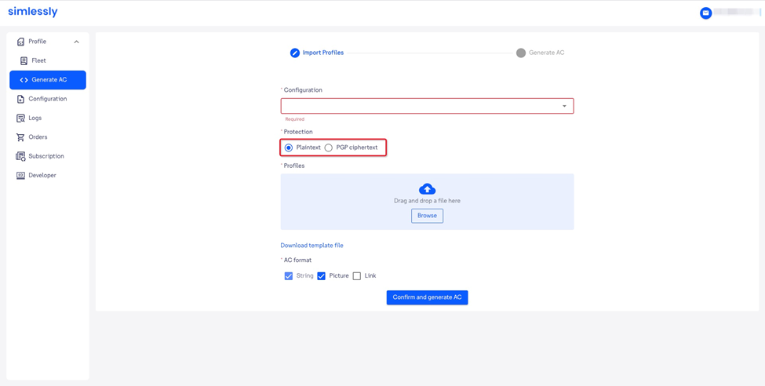

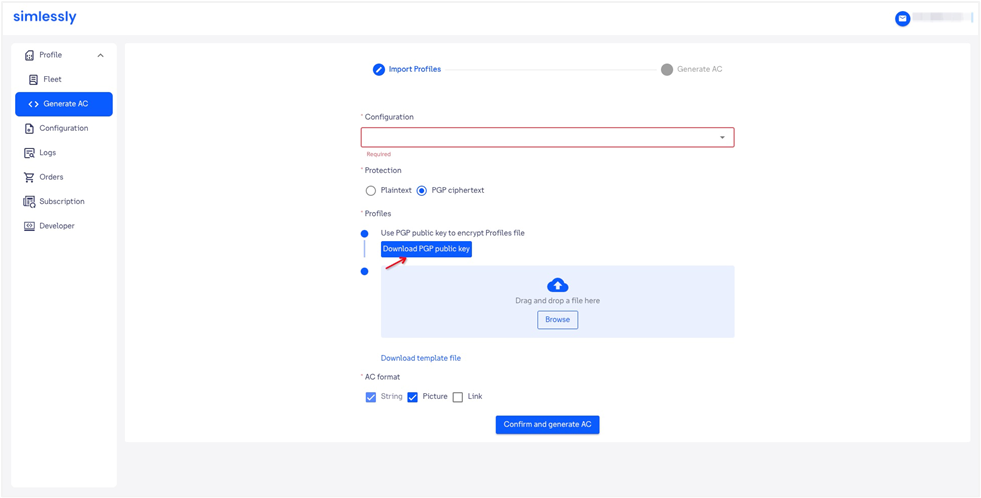

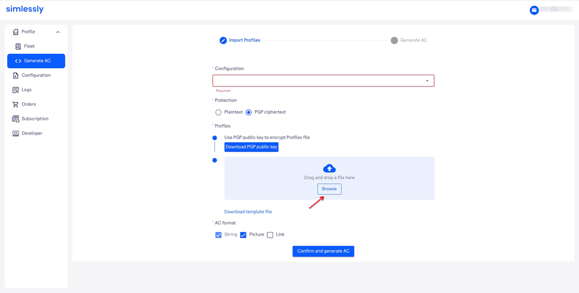

5). Select AC format (String/Picture/Link);

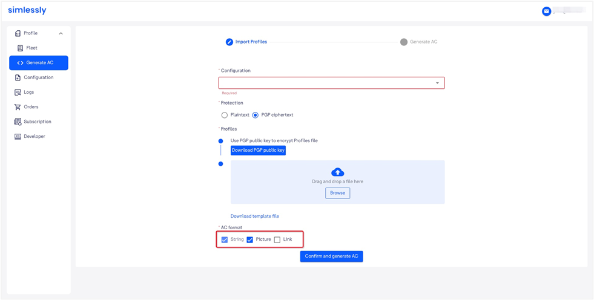

6). Click Confirm and Generate AC.

### Download AC

#### Batch Download 

1). Enter the Logs page.

2). After you have uploaded a batch of Profiles, the platform will display “COMPLETE” in the Process column, with an upload result bar indicating import result (success/failure) by different color (green/pink). When the import is successful, click the button Download AC to download the AC; when the import fails, click Download Error to query the failure reason.

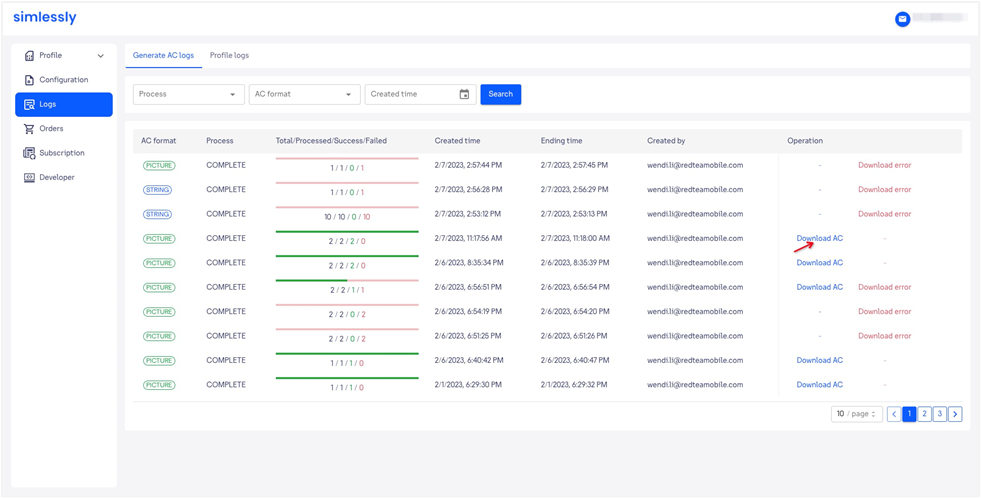

#### Single Download
1). Enter the Fleet page (Profile -> Fleet), click QR code icon to query the QR Code in AC QR column, then click Download button to download the QR Code.

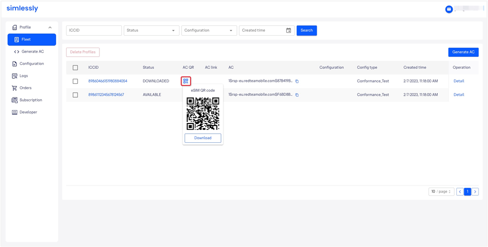

### Query AC Status 

1). In the Fleet page (Profile -> Fleet), search the Profile by ICCID, then query the AC status in the Status column.

Profile Status Description

<table>
    <tr>
        <th>Status</th>
        <th>Description</th>
    </tr>
    <tr>
        <td>AVAILABLE</td>
        <td>Profile has been imported and AC is generated. Profile is idle and available for download.</td>
    </tr>
    <tr>
        <td>CANCELED</td>
        <td>Profile download has been canceled.</td>
    </tr>
    <tr>
        <td>ERROR</td>
        <td>Error occurred during Profile download.</td>
    </tr>
    <tr>
        <td>DOWNLOADED</td>
        <td>Profile has been downloaded to the user’s device.</td>
    </tr>
    <tr>
        <td>INSTALLED</td>
        <td>Profile has been successfully installed on the user’s device.</td>
    </tr>
    <tr>
        <td>ENABLE</td>
        <td>eSIM is enabled by the user.</td>
    </tr>
    <tr>
        <td>DISABLE</td>
        <td>eSIM is disabled by the user.</td>
    </tr>
    <tr>
        <td>DELETE</td>
        <td>Profile has been deleted on the Simlessly RSP platform.</td>
    </tr>
</table>

2). Click Detail in the operation column to query the status change by timeline.

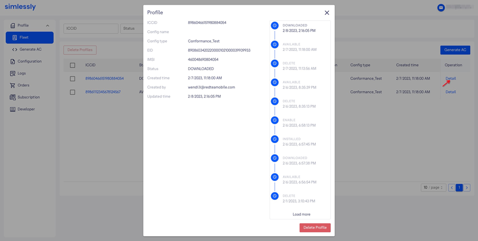

3). Enter the Logs page, click Profile logs to enter the Profile logs tab pane, where all the Profile status changes are recorded by timeline. The reason in case of failure is also displayed.

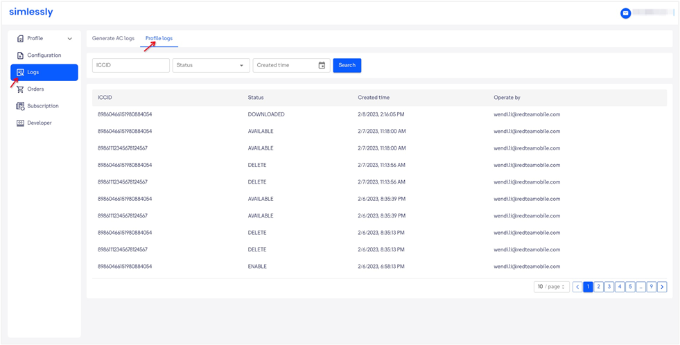