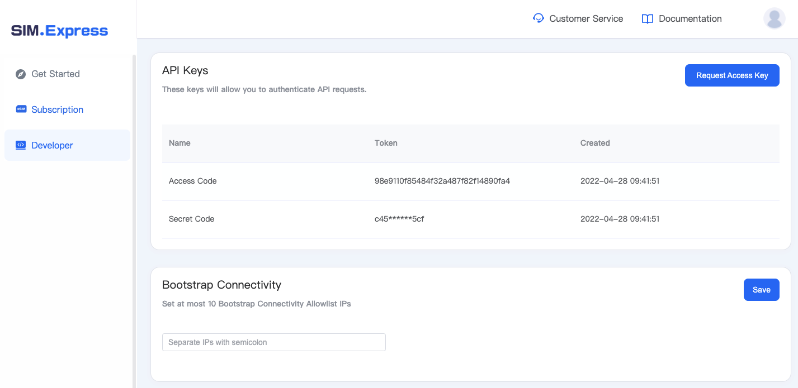

## Request Lookup Server API Keys

To integrate with Lookup Server APIs, you need to request Public Code and Secret Code firstly, which can be obtained in SIM.Express console (<https://console.sim.express/>). The keys are generated only at the first access, and will not be shown on the console later, please keep them after generation. The approach to obtain the Keys is shown in the following diagram.  

