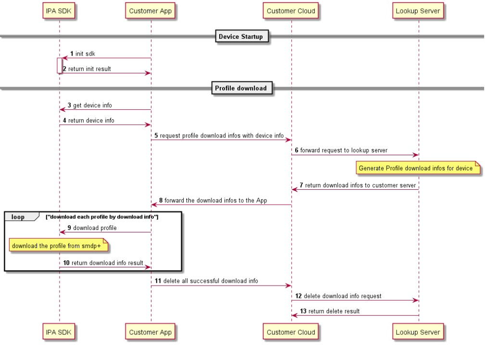
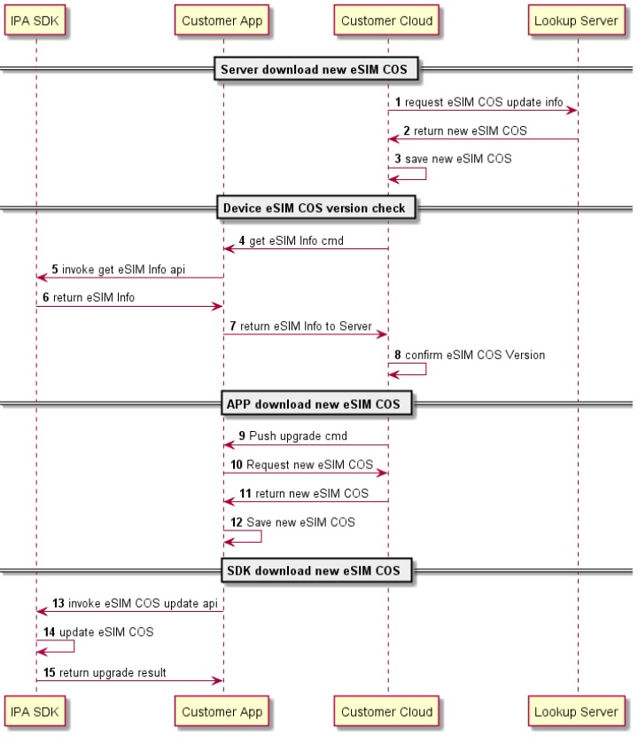
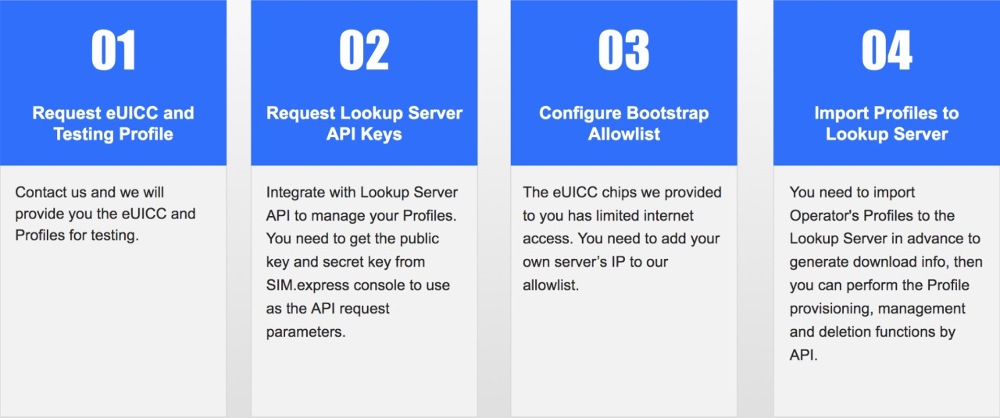
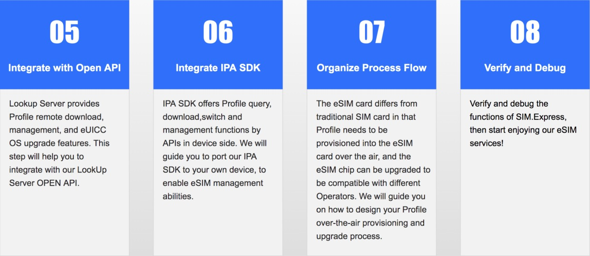

## Process Flow
### Integration Procedure
- Customer integrate its Cloud Server with  Lookup Cloud Server API;
- Customer integrate IPA SDK with its Device App;
- Customer embed the eUICC chip into its Device.
### Profile Provisioning Process

<!--  -->

### eSIM OS Upgrade Process

<!--  -->

## Environment Preparation

<!--  -->

## Debugging and Verification

<!--  -->
