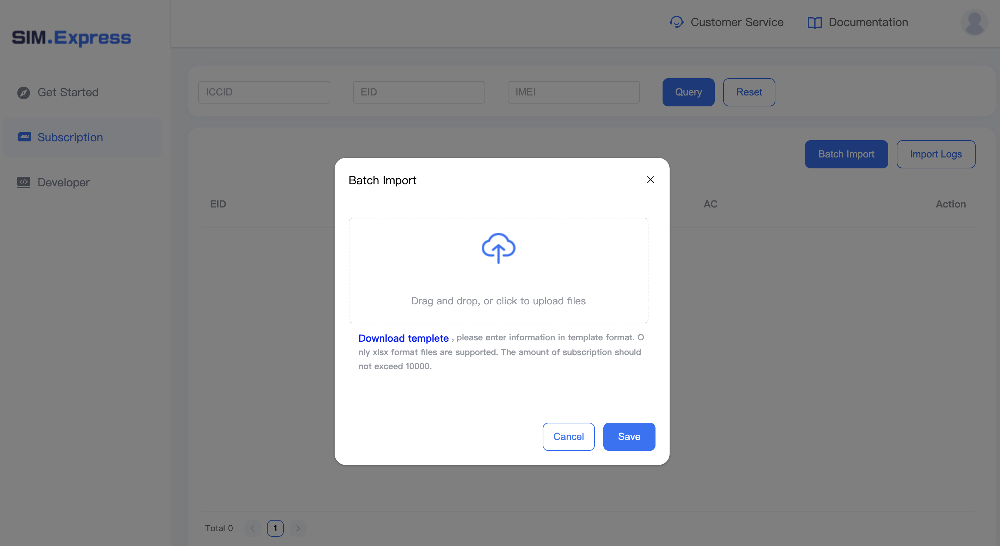

## Import Profiles to Lookup Server
### Import via Lookup Server Console
- Clickthe SIM.Express console website
- Enter the Subscription page
- Click the “batch import” button
- Download the Profile info template
- Fill in the necessary information 
- Upload the template

### Import by Lookup Server API
For the parameters, refer to the [API description](https://docs.sim.express/api/ApiRefence/signature.html) .

