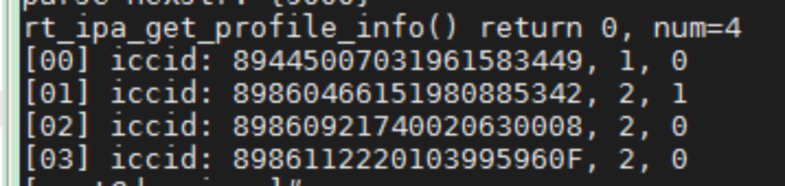
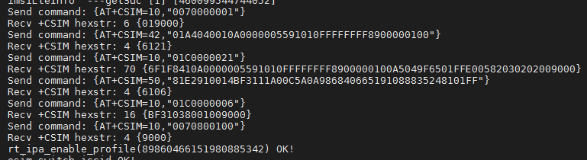

## Integration Preparation:
### IPA SDK contains the following files:
<table>
    <tr>
        <th>File Name</th>
        <th>Description</th>
    </tr>
    <tr>
        <td>libipa.so</td>
        <td>IPA SDK library ,  having different suffixes on different platforms</td>
    </tr>
    <tr>
        <td>rt_app_ipa.h</td>
        <td>
        Device API header file declaration. For the details, see the description in <a href="https://docs.sim.express/api/ApiRefence/sdk.html">IPA SDK API.</a></td>
    </tr>
    <tr>
        <td>rt_ipa_port.h</td>
        <td>Declaration of interface header file that user need to adapt and port to different platforms</td>
    </tr>
    <tr>
        <td>rt_port.c</td>
        <td>System API that the user needs to port and adapt, we will provide  the demo code, user can modify the specific implementation according to the specific system and requirements. </td>
    </tr>
    <tr>
        <td>test_ipa_demo.c</td>
        <td>IPA SDK interface demo code</td>
    </tr>
</table>

## Adaption Process
- You need to provide the compilation tool chain first, so that our team can compile the corresponding library for your system;
- Transplant the Port codes and library into your system application;
- Adapt the Port API in accordance with your device’s system;

## Integration Instruction
IPA SDK is an IoT Profile Assistant, which is provided in software SDK library and needs to be adapted and integrated in the external MCU or inside the module.   

The port SDK interfaces are system interfaces, including standard C library interfaces, Modem interaction interfaces, thread synchronization interfaces and network communication interfaces. Considering the interfaces between different operation systems may not be compatible, in order to adapt to a new platform easily, Redtea Mobile provides reference Port source code. The customer need to read the description of the system interfaces and enable the functions as shown below.

<table>
	<tr>
		<td rowspan="6">Standard C Library Interfaces</td>
	</tr>
	<tr >
		<td>rt_port_heap_malloc</td>
        <td >Same function as standard C interface malloc</td>
	</tr>
    <tr>
		<td>rt_port_heap_free</td>
        <td>Same function as standard C interface free</td>
	</tr>
    <tr>
		<td >rt_port_sprintf</td>
        <td >Same function as standard C interface sprintf</td>
	</tr>
    <tr>
		<td>rt_port_snprintf</td>
        <td>Same function as standard C interface snprintf</td>
	</tr>
    <tr>
		<td >rt_port_sscanf</td>
        <td >Same function as standard C interface sscanf</td>
	</tr>
    <tr>
		<td rowspan="3">Basic Functions Interfaces</td>
	</tr>
    <tr>
		<td>rt_port_log_print_array</td>
        <td>LOG interface, used to print array of a specified length</td>
	</tr>
    <tr>
		<td>rt_port_log_print</td>
        <td>LOG print interface</td>
	</tr>
    <tr>
		<td  rowspan="3">Modem Interfaces</td>
	</tr>
    <tr>
		<td >rt_port_modem_get_imei</td>
        <td >Get module IMEI</td>
	</tr>
    <tr>
		<td>rt_port_modem_usim_transimit_apdu</td>
        <td>Send APDU command to e-SIM card</td>
	</tr>
    <tr>
		<td rowspan="5">Thread and Synchronization Interfaces</td>
	</tr>
	<tr>
		<td>rt_task_sleep</td>
        <td>Task dormancy or cyclic waiting function</td>
	</tr>
    <tr>
		<td>rt_port_mutex_create</td>
        <td>Create a mutex</td>
	</tr>
    <tr>
		<td>rt_port_mutex_lock</td>
        <td>Lock mutex</td>
	</tr>
    <tr>
		<td>rt_port_mutex_unlock</td>
        <td>Unlock mutex</td>
	</tr>
    <tr>
		<td rowspan="4">HTTPS Communication interfaces</td>
	</tr>
	<tr>
		<td>rt_port_http_client_create</td>
        <td>Create and initialize http client</td>
	</tr>
    <tr>
		<td>rt_port_http_client_destroy</td>
        <td>Destroy a specified http client</td>
	</tr>
    <tr>
		<td>rt_port_http_post</td>
        <td>Http client post request</td>
	</tr>
    <tr>
		<td rowspan="5">Other Functional Interfaces</td>
	</tr>
	<tr>
		<td>rt_port_read_flash</td>
        <td>Read FLASH data</td>
	</tr>
    <tr>
		<td>rt_port_watch_dog</td>
        <td>Watchdog</td>
	</tr>
    <tr>
		<td>rt_port_reset_esim</td>
        <td>Reset eSIM</td>
	</tr>
    <tr>
		<td>rt_port_get_buffer</td>
        <td>Get the system global buffer</td>
	</tr>
</table>

For the detailed description and implementation of Port interfaces, please check the description in **Port Demo SDK** and in [HAL Port API](https://docs.sim.express/api/ApiRefence/port.html);

- Customer provide compilation tool chain or module SDK (or provide compilation parameters if it is DS5 or a similar general development tool);
- Redtea Mobile SIM.Express team compile the IPA into library for the customer with the compilation tool chain or module SDK;
- The customer copy the Port source code to its own application code;
- The customer transplant relevant system interfaces in reference to Redtea Mobile’s Port source code;
- The customer call Redtea Mobile’s API to implement service logic;
- The customer compile the application or firmware package after linking with the Redtea Mobile  library file.

## IPA SDK API Reference
The SDK provides interfaces for downloading and managing Profiles, the customer shall call the relevant interface in accordance with its own business logic, to implement relevant service functions.
<table>
    <tr>
        <th>Functions</th>
        <th>Prototype</th>
    </tr>
    <tr>
        <td>InitializeIPA</td>
        <td>int rt_ipa_init(void *arg)</td>
    </tr>
    <tr>
        <td>GetEID</td>
        <td>int rt_ipa_get_eid(unsigned char *eid)</td>
    </tr>
    <tr>
        <td>GetProfileInfo</td>
        <td>int rt_ipa_get_profile_info(profile_info_t *profile_info, unsigned int *num)</td>
    </tr>
    <tr>
        <td>EnableProfile</td>
        <td>int rt_ipa_enable_profile(const char *iccid)</td>
    </tr>
    <tr>
        <td>RequestDeviceInfo</td>
        <td>int rt_ipa_request_device_info(unsigned char *info, unsigned int *info_size)</td>
    </tr>
    <tr>
        <td>DownloadProfile</td>
        <td>iint rt_ipa_download_profile(const unsigned char *info, unsigned int info_len)</td>
    </tr>
    <tr>
        <td>RequesteSIMInfo</td>
        <td>int rt_ipa_request_esim_info(unsigned char *info, unsigned int *info_size)</td>
    </tr>
    <tr>
        <td>UpgradeeSIMOS</td>
        <td>int rt_ipa_upgrade_esim_os(unsigned int addr, unsigned int length)</td>
    </tr>
</table>

- When the customer use the device API for the first time after starting its application, the customer shall call the “InitializeIPA” interface to initialize the terminal API.

- The customer’s application call the “GetEID” and “GetProfileInfo” interfaces to query the information of the device.
- The customer’s application call the “RequestDeviceInfo” interface to obtain relevant information of the device.
- The customer’s application call the “DownloadProfile” interface to download Profile from SM-DP+ to the device.
  
## Verification Steps:
 
- Simple eSIM functions check: Check whether the functions of reading EID, obtaining device info, obtaining Profile info, printing logs, sending and receiving APDU are normal;
  

- Local Profile management function check: Enable the Profile, and check whether the modem works normally after Profile is switched;

- Profile download function check: Check whether HTTPS functions normally, and whether the downloaded Profile can be used normally;
- Verify other eSIM management functions per service logic.
