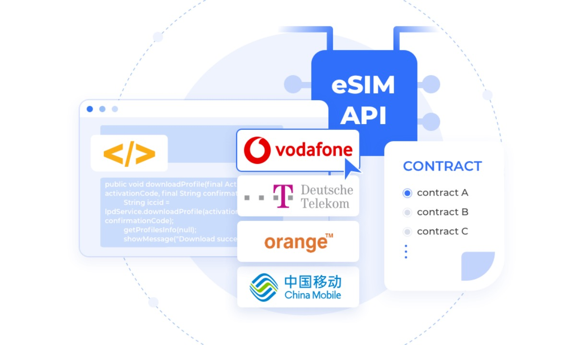

## Product Highlights
 
 

### eSIM API
We provide eUICC chip, device SDK and cloud server API,  customer can use the eSIM API for secondary development according to your own specific scenarios, such as:
- Flexible selecting and switching of MNOs and MVNOs.
- Network monitoring, multi-network, backup-network.
- Digitized SIM lifecycle management .

### Efficient Device Onboarding
We provide end-to-end eSIM solutions, tedious process of SIM lifecycle management is now streamlined with one eSIM SKU, for fast go-to-market process for massive and global IoT deployment.
### IoT Business Scalability
We provide GSMA-compliant eUICC, supporting various form factors of eSIM chip requirements in the market. Our eSIM cards are compatible with most of the eSIM DP+ vendors in accordance with the GSMA consumer specifications.
### Value-added Service
We provide a pre-loaded global profile in the eUICC which is used as an initial network for operational Profile download, device testing and network backup.

### Solid Security with data privacy
Our device software does not access the customer server directly, so as to ensure the privacy and security of the data in the IoT device. Besides, the data process with eSIM download subscriptions is encrypted from end to end to prevent tampering and monitoring.
