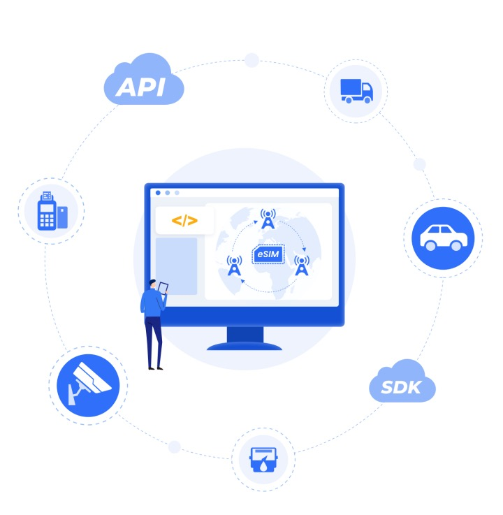

## Introduction
### What is SIM.Express?

SIM.Express offers easy-to-use and developer-friendly eSIM APIs that work for IoT, with quick access to global MNOs and MVNOs, making cellular connectivity programmable and reprogrammable for massive IoT.

SIM.Express Enabling fast secondary development on your own, to implement remote and flexible switching of global MNO and MVNOs, highly efficient device on boarding of eSIM capability. 

To compare traditional solutions with SIM.Express(tailored consumer eSIM infrastructure for IoT): 
[Comparison of all the SIM Solutions in Market]( https://forum.sim.express/t/comparison-of-all-the-sim-solutions-in-market/22)

 ### What does SIM.Express include?
 SIM.Express = eUICC + IPA SDK + Lookup Server API + Bootstrap Connectivity.

<table>
    <tr>
        <th>Product Components</th>
        <th>Descriptions</th>
    </tr>
    <tr>
        <td>Lookup Server</td>
        <td>The Lookup Server is used to implement eSIM Profile import and management, a cloud managed platform packaged into APIs for external calling; a web portal is also provided.</td>
    </tr>
    <tr>
        <td>IPA SDK</td>
        <td>IPA is an IoT Profile Assistant, provided in the SDK library, and needs to be integrated within the MCU or module.</td>
    </tr>
    <tr>
        <td>Standard eUICC</td>
        <td>eUICC is an embedded Universal Integrated Circuit Card used for secure storage of Profile and network authentication. We provide embedded and plug-in eUICC chips in different form factors, such as MFF2 QFN8 5*6 and Plugin 4FF/3FF/2FF.</td>
    </tr>
    <tr>
        <td>Bootstrap Connectivity</td>
        <td>Pre-loaded global profile to provide initial connectivity, for the remote download of eSIM profiles anytime anywhere, also important for global testing and backup insurance to restore network in case of signal loss.</td>
    </tr>
</table>

In addition,  online [documentations](https://docs.sim.express/guide/SimExpress/introduction.html), [API References](https://docs.sim.express/api/ApiRefence/signature.html) are provided to guide you through the whole process of deployment, to help with connecting your IoT device instantly. We also designed a [community forum](https://forum.sim.express) for developers and enterprise customers to engage with SIM.Express engineers and IoT developers focusing on cellular IoT connectivity. Developers could quickly start with our docs and free samples of eUICC with bootstrap connectivity and eSIM downloads subscriptions as well as free trials of eSIM APIs and SDK.

