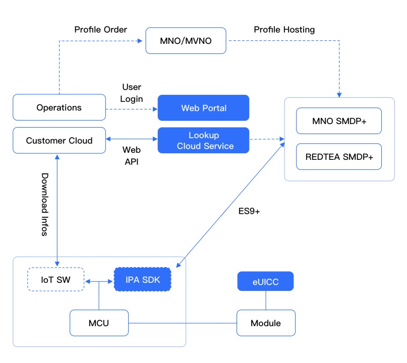

## Product Architecture
<!--  -->

## Lookup Server
- Profile import and management
- Over-the-air eSIM OS upgrade
- API interfaces for external calling
- Visualized management web portal
## IPA SDK
- An IoT Profile assistant, providing Profile download and management functions
- Designed for IoT, highly portable, supporting Linux, RTOS and Android
- Use ROM about 30KB and RAM about 12KB
## eUICC
- Core security component, enabling secure storage of Profile and network authentication
- Embedded eUICC chips and plug-in eUICC with different form factors
- Preloaded Bootstrap Connectivity with global coverage
