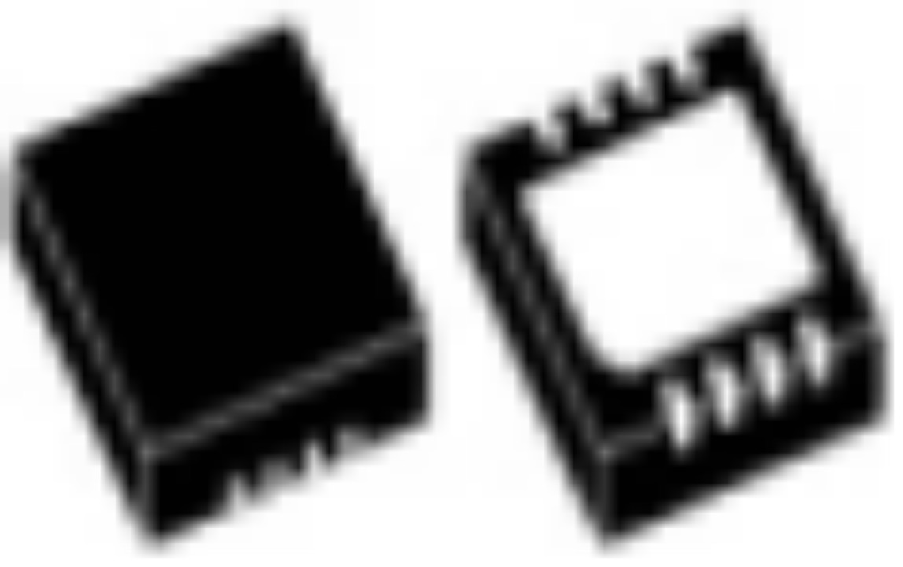
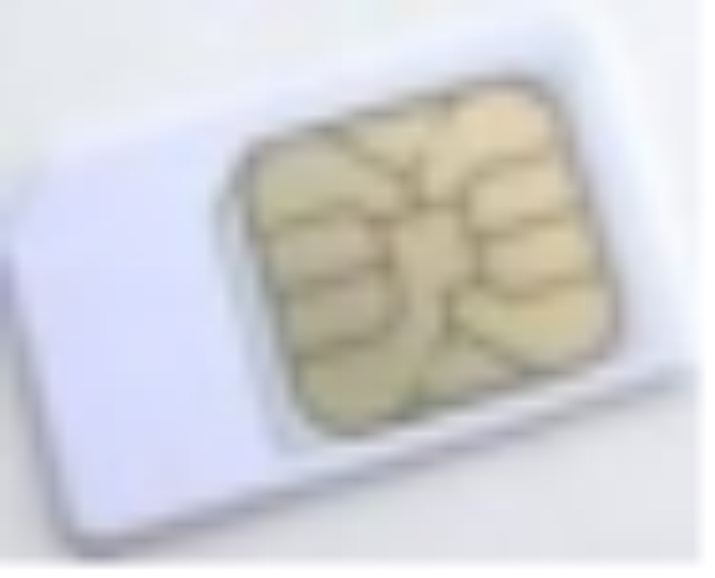
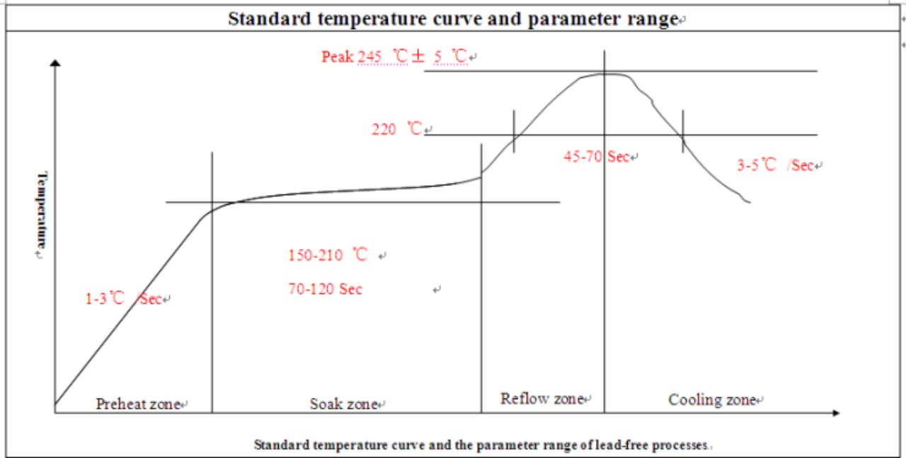
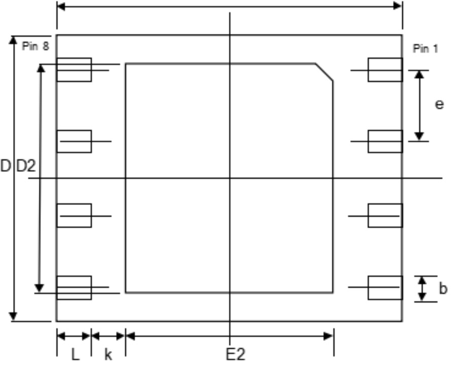

## Product Features

<table>
    <tr>
        <td colspan="2">eUICC</td>
    </tr>
    <tr>
        <td>Max Profiles</td>
        <td>10</td>
    </tr>
     <tr>
        <td>Specification</td>
        <td>SGP 22 v2.3</td>
    </tr>
    <tr>
        <td colspan="2">JavaCard</td>
    </tr>
    <tr>
        <td>Specification</td>
        <td>JavaCard v3.0.4</td>
    </tr>
    <tr>
        <td>Extension APIs</td>
        <td>UICC API (ETSI 102241) 
USIM API (ETSI 131130) 
GlobalPlatform API 
</td>
    </tr>
    <tr>
        <td>Algorithms</td>
        <td>DES/AES/SM1/SM4 
RSA//ECC/SM2 
CRC16/CRC32 
MD5/SHA1/SHA256/SM3 
HMAC
</td>
    </tr>
    <tr>
        <td colspan="2">GlobalPlatform</td>
    </tr>
    <tr>
        <td>Specification</td>
        <td>V2.3</td>
    </tr>
    <tr>
        <td>Security Channel</td>
        <td>SCP 02/SCP 03/SCP 80/SCP 81</td>
    </tr>
    <tr>
        <td colspan="2">UICC</td>
    </tr>
    <tr>
        <td>Logic Channel</td>
        <td>8 (4 contact channels + 4 contactless channels)</td>
    </tr>
    <tr>
        <td colspan="2">USIM</td>
    </tr>
    <tr>
        <td>Milenage Algorithm</td>
        <td>Supported</td>
    </tr>
    <tr>
        <td>TUAK</td>
        <td>Supported</td>
    </tr>
    <tr>
        <td>ISIM</td>
        <td>Supported</td>
    </tr>
</table>

## Hardware Specifications

<table>
    <tr>
        <th>Product</th>
        <th>Industrial grade patch</th>
        <th>Consumer grade patch</th>
        <th>plug in Consumer plug in</th>
    </tr>
    <tr>
        <td>Encapsulation</td>
        <td>QFN8 </td>
        <td>QFN8 </td>
        <td>plug in </td>
    </tr>
    <tr>
        <td>Size</td>
        <td>
            5 mm x 6 mm  
            4 mm x 4.2 mm  
            2.5 mm x 2.7 mm
        </td>
        <td>
            5 mm x 6 mm  
            4 mm x 4.2 mm  
            2.5 mm x 2.7 mm
        </td>
        <td>
            2FF  
            3FF 
            4FF
        </td>
    </tr>
    <tr>
        <td>Operation Temperature</td>
        <td>
            -40°C to + 105°C
        </td>
        <td colspan="2">
            -25°C to + 85°C
        </td>
    </tr>
    <tr>
        <td>Operation System</td>
        <td>
                <li>Supports 2G/3G/4G/5G networks, conforming to China Unicom’s relevant IoT card specifications</li>   
                <li>Super long service life (> 500,000 data erasures)</li> 
                <li>Support data message customization application (such as OTA application over-the-air loading, etc.)</li>
        </td>
        <td colspan="2">
            <li>Supports 2G/3G/4G/5G networks,  conforming to China Unicom’s relevant IoT card specifications</li> 
            <li>Support 100,000 data erasures</li>   
            <li>Support data message customization application (such as OTA application over-the-air loading, etc.)</li>           
        </td>
    </tr>
    <tr>
        <td>Electrical Features</td>
        <td colspan="3">
            Voltage Range: from 1.62V to 5.5V  
            Maximum working current: < 10ma @ 5v;  < 6 mA @ 3.3 V; < 4 mA @ 1.98 V
        </td>
    </tr>
    <tr>
        <td>ESD Protection</td>
        <td colspan="3">
           Larger than 4000 V (HBM)
        </td>
    </tr>
    <tr>
        <td colspan="4">
           Note: If you need to customize the package size, please contact us for consultation.
        </td>
    </tr>
</table>

## Security Features

<table>
    <tr>
        <td>Authentication Algorithm Supported</td>
        <td>Comp128-v1, Comp128-v2, Comp128-v3,Comp128-v4, milenage</td>
    </tr>
    <tr>
        <td>Security Algorithm Supported</td>
        <td>DES, 3DES (ECB and CBC mode)，SHA-1, MD5</td>
    </tr>
    <tr>
        <td>Certified Security Level</td>
        <td>EAL4+</td>
    </tr>
    <tr>
        <td>Security Protection</td>
        <td>Single power attacks (SPA) Differential power attacks (DPA) Fault attacks (FA)</td>
    </tr>
    <tr>
        <td>Certification</td>
        <td>GSMA certificate and CAICT certificate are supported</td>
    </tr>
</table>

## Recommended Welding Temperature Curve (for SMD Card)

Recommended Welding Temperature Curve of Module (Lead-free Process)

## Encapsulation Size and Pin Definition (5 mm x 6 mm)

 

 Structural Dimension Drawing of MFF2 (Bottom View)

Note: The inner joint can be rectangular or circular. For the comparison of the encapsulation pins and UICC contacts, see the above figure.

## Size of MFF2
<table>
    <tr>
        <th>parameter</th>
        <th>Description</th>
        <th>Size (mm)</th>
    </tr>
    <tr>
        <td>E</td>
        <td>Horizontal length of the encapsulation</td>
        <td>6.00 ± 0.15</td>
    </tr>
    <tr>
        <td>D</td>
        <td>Vertical length of the encapsulation</td>
        <td>5.00 ± 0.15</td>
    </tr>
    <tr>
        <td>L</td>
        <td>Horizontal length of external pins</td>
        <td>0.60 ± 0.15</td>
    </tr>
    <tr>
        <td>B</td>
        <td>Minimum vertical distance of external metal pins</td>
        <td>0.40 ± 0.10</td>
    </tr>
    <tr>
        <td>E2</td>
        <td>Horizontal length of internal heat sink</td>
        <td>min 3.30</td>
    </tr>
    <tr>
        <td>D2</td>
        <td>Vertical length of internal heat sink</td>
        <td>min 3.90</td>
    </tr>
    <tr>
        <td>K</td>
        <td>Minimum distance between the external pin and the internal heat sink</td>
        <td>min 0.20</td>
    </tr>
    <tr>
        <td>E</td>
        <td>Distance between the external metal pin centerline and the adjacent metal pin centerline</td>
        <td>1.27 tolerances are described in bbb and ddd</td>
    </tr>
    <tr>
        <td>Bbb</td>
        <td>Tolerance of centerline</td>
        <td>0.10</td>
    </tr>
    <tr>
        <td>Ddd</td>
        <td>Tolerance of distance between contacts</td>
        <td>0.05</td>
    </tr>
</table>

### Pin Description
<table>
    <tr>
        <th>Pin No.</th>
        <th>Definition</th>
        <th>Description</th>
        <th>Remarks</th>
    </tr>
    <tr>
        <td>PIN1</td>
        <td>GND</td>
        <td>7816 interface universal ground</td>
        <td>-5.5V~+5.5V (Please do not exceed during testing)</td>
    </tr>
    <tr>
        <td>PIN2</td>
        <td>NC</td>
        <td>Not occupied</td>
        <td>/</td>
    </tr>
    <tr>
        <td>PIN3</td>
        <td>IO</td>
        <td>7816 interface input and output </td>
        <td>-5.5V~+5.5V (Please do not exceed during testing)</td>
    </tr>
    <tr>
        <td>PIN4</td>
        <td>NC</td>
        <td>Not occupied</td>
        <td>/</td>
    </tr>
    <tr>
        <td>PIN5</td>
        <td>NC</td>
        <td>Not occupied</td>
        <td>/</td>
    </tr>
    <tr>
        <td>PIN6</td>
        <td>CLK</td>
        <td>7816 interface clock</td>
        <td>-5.5V~+5.5V (Please do not exceed during testing)</td>
    </tr>
    <tr>
        <td>PIN7</td>
        <td>RST</td>
        <td>7816 interface resetting</td>
        <td>-5.5V~+5.5V (Please do not exceed during testing)</td>
    </tr>
    <tr>
        <td>PIN8</td>
        <td>VCC</td>
        <td>7816 interface power</td>
        <td>-5.5V~+5.5V (Please do not exceed during testing)</td>
    </tr>
</table>
